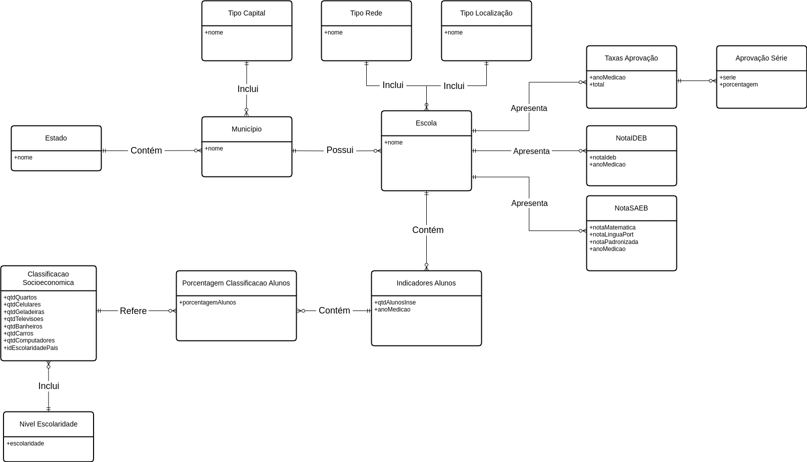
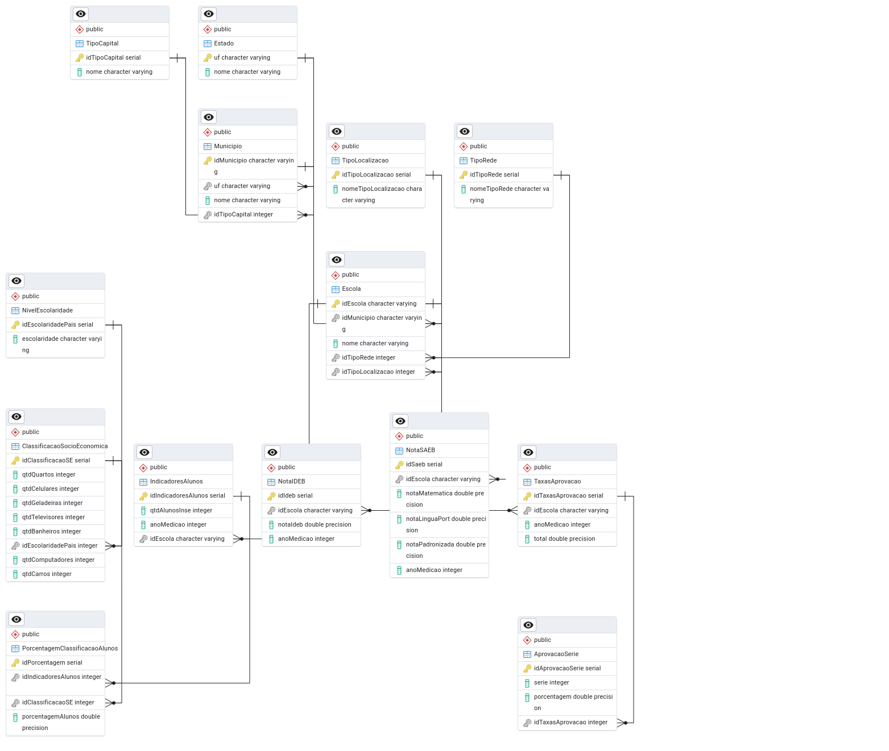

# MC536: Database Project - Analysis of Brazilian students' scores in the Basic Education Assessment System (Saeb) in correlation with their socioeconomic status

## Project Overview
This project was developed by
<br/>[Mateus Farha Ribeiro](https://github.com/mateusfarhaa)  (252678)
<br/>[Rafael Scalabrin Dosso](https://github.com/rafael-dosso)  (205237)
<br/>[Lucas Lembo de Lara](https://github.com/lucas-lembo)  (254467)

## Database Schema Overview

The initial phase of our project involved developing both the conceptual and relational models of our relational database (PostgreSQL).
This foundation enabled us to analyze the relationships between school SAEB scores, IDEB (Basic Education Development Index) scores,
students' socioeconomic levels, and the geographical locations of these schools (capital, interior, rural, urban).

**Figure 1: Conceptual Model (ER Diagram)**
<p align="center">
  
</p>

**Figure 2: Relational (Logical) Model**
<p align="center">
  
</p>

*(The detailed Physical Model SQL script can be found [here](./models/Physical_Model.sql)).*


## Table of Contents

- [Project Overview](#project-overview)
- [Database Schema Overview](#database-schema-overview)
- [Table of Contents](#table-of-contents)
- [Datasets](#datasets)
    - [Original Data](#original-data)
    - [Preprocessed Data](#preprocessed-data)
    - [Database Setup and Population](#database-setup-and-population)
- [Analysis \& Queries](#analysis--queries)
- [Results](#results)

## Datasets

### Original Data

The raw data was sourced from Inep (Instituto Nacional de Estudos e Pesquisas Educacionais Anísio Teixeira). The original files used for preprocessing are located in the `datasets/` directory:

*   `divulgacao_ensino_medio_escolas_2023.csv`: Contains data on school approval rates, Saeb scores, and Ideb scores for different years.
*   `INSE_2021_escolas.csv`: Contains data on the location of schools and the percentage of students in each socioeconomic classification at each level.

### Preprocessed Data

The original datasets, which lie in the `datasets/unprocessed/` folder, were preprocessed to fit the designed database schema in the Jupyter Notebook at [`preprocessing.ipynb`](./scripts/preprocessing.ipynb). The resulting cleaned CSV files, used for loading into the database, are located in the `datasets/` directory:

*   `desempenho_escolar.csv`
*   `indicadores_socio_economicos.csv`

The preprocessing steps applied to the original datasets can be found in [`scripts/preprocessing.ipynb`](./scripts/preprocessing.ipynb). This notebook contains a full explanation of the methods used, along with the complete preprocessing code.


### Database Setup and Population

1.  **Create Database:** Using pgAdmin4, create a new PostgreSQL database. The default name used in the script is `Projeto 1`.
    ```sql
    CREATE DATABASE "Projeto 1";
    ```

2.  **Configure Connection:** Create a Python file at `scripts/secrets_db.py` and insert the following connection parameters:

    ```python
    # --- Database Connection Parameters ---
    BASE_NAME = "Projeto 1"  # Your database name
    USERNAME = "postgres"  # Your Postgres username
    HOST = "localhost"
    PASSWORD = "password" # <--- CHANGE THIS TO YOUR PASSWORD
    ```

3.  **Populating Database:** To populate the database with the values within the dataset, you will need to run the population script located in [`scripts/populate_db.py`](./scripts/populate_db.py):
- Initialize a Python Virutal Environmnt
```terminal
  python -m venv environment
  source environment/bin/activate
```
- Install the Pip dependencies:
```terminal
  pip install -r requirements.txt
```
- Run the script:
```terminal
  python scripts/populate_db.py
```

## Analysis & Queries
The five non-trivial queries are located in the `queries/` directory, and below is a basic explanation of what each one filters and how to interpret the results.

1. Comparison of SAEB Performance Among Rural Schools Across All States:
In this query, we observe that states with lower socioeconomic indices tend to have the lowest scores in Portuguese and Mathematics, while states with higher socioeconomic indices achieve the highest scores. This suggests a clear correlation between students’ performance on the SAEB and their socioeconomic conditions.

2. Comparison of Weighted Average Scores in Portuguese and Mathematics Between Rural and Urban Schools Within the Same State:
This query analyzes how school location (rural vs. urban) affects performance within the same state. In most cases, we observe that urban areas have higher average socioeconomic levels and also achieve better scores in Portuguese and Mathematics. However, there are a few exceptions where, despite higher socioeconomic averages in urban areas, rural schools perform better in terms of academic scores.

3. Comparison between the average SAEB scores in Portuguese and Mathematics and the high school student approval rates over the years 2017, 2019, 2021, and 2023:
This query shows that between 2019 and 2021, several states experienced a significant decline either in average SAEB scores or in student approval rates. This drop may have been primarily caused by the impact of the COVID-19 pandemic.

4. Comparison Between IDEB Scores and Socioeconomic Averages Within the Same School Network Type (State, Municipal, Federal):
This query examines how IDEB (Basic Education Development Index) scores relate to socioeconomic levels across different types of school networks. We observe that federal schools have the highest IDEB scores, followed by municipal and then state schools. Interestingly, the socioeconomic indices follow the same pattern—federal schools have the highest averages, followed by municipal and state schools. This suggests a strong influence of the school network type on both student performance and socioeconomic status.

5. Comparison Between Schools in the Same State Located in the Capital vs. the Countryside, and How Socioeconomic Levels Influence Portuguese and Math Scores:
This query explores the impact of school location, whether in the state capital or the countryside, on academic performance and socioeconomic conditions. We observe that state capitals generally have higher socioeconomic levels than inland areas. Interestingly, this pattern is also reflected in academic outcomes: schools in capital cities tend to have higher Portuguese and Mathematics scores compared to those in the countryside.

## Results

The output generated by executing the queries are saved as CSV files in the `results/` directory:

*   [`Query 1 Results`](./results/query1.csv)
*   [`Query 2 Results`](./results/query2.csv)
*   [`Query 3 Results`](./results/query3.csv)
*   [`Query 4 Results`](./results/query4.csv)
*   [`Query 5 Results`](./results/query5.csv)
